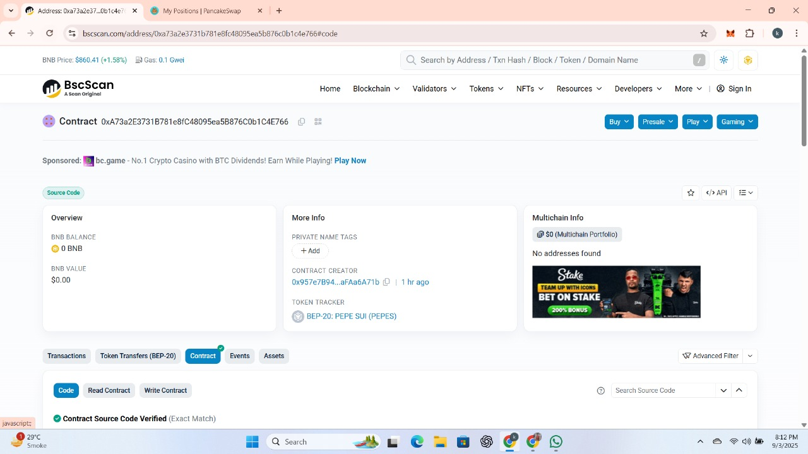
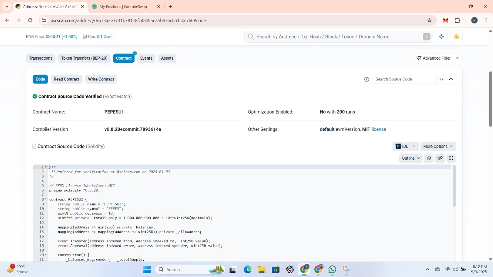
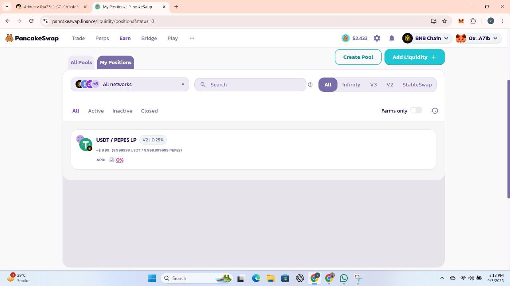

\# PEPE SUI (PEPES)

\- \*\*Token Name:\*\* PEPE SUI  

\- \*\*Token Symbol:\*\* PEPES  

\- \*\*Smart Contract Address:\*\* 0xA73a2E3731B781e8fC48095ea5B876C0b1C4E766  

\- \*\*Verification:\*\* VERIFIED  

\- \*\*Network:\*\* BNB Smart Chain (BSC)  

\- \*\*Live Link:\*\* https://bscscan.com/address/0xa73a2e3731b781e8fc48095ea5b876c0b1c4e766

\- \*\*Liquidity:\*\* PancakeSwap  

\- \*\*Tool:\*\* Remix IDE  

\- \*\*Language:\*\* Solidity  

&nbsp; 

&nbsp; 

&nbsp; 

