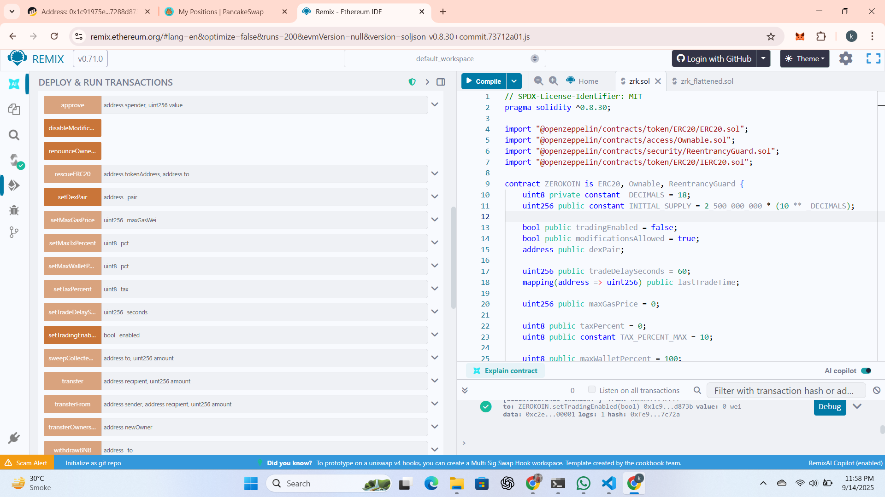
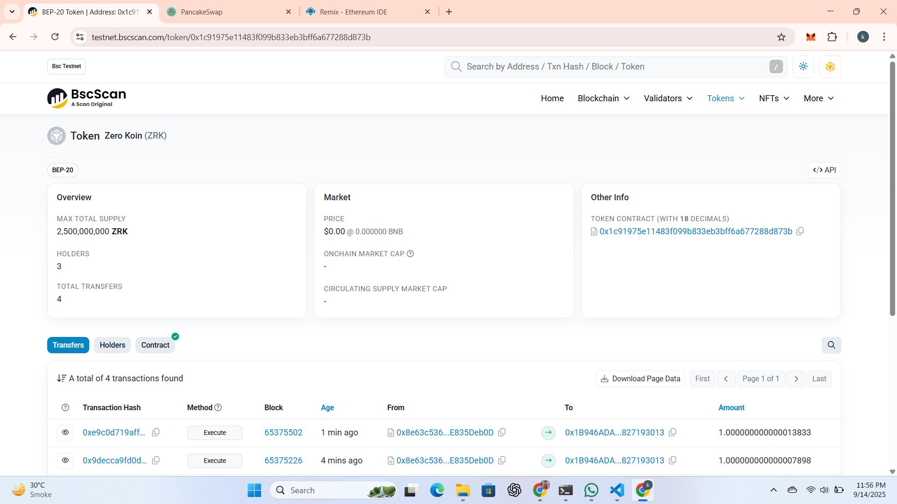
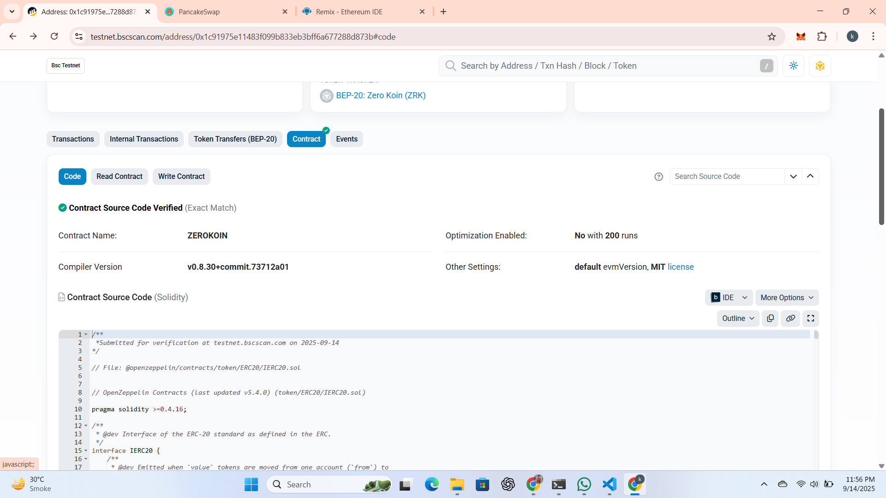
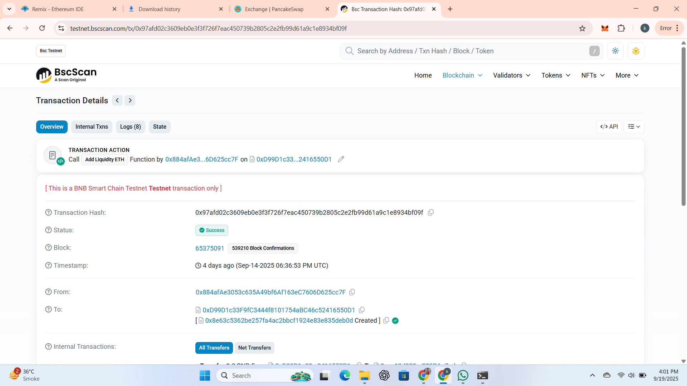
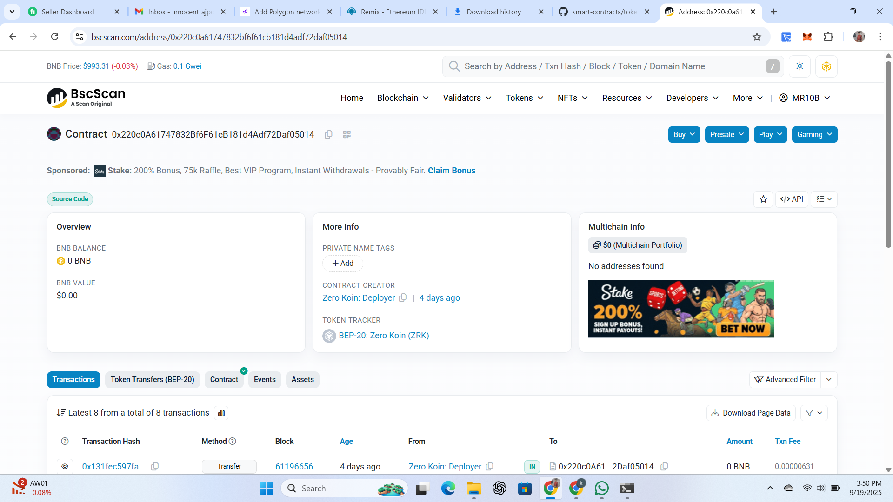
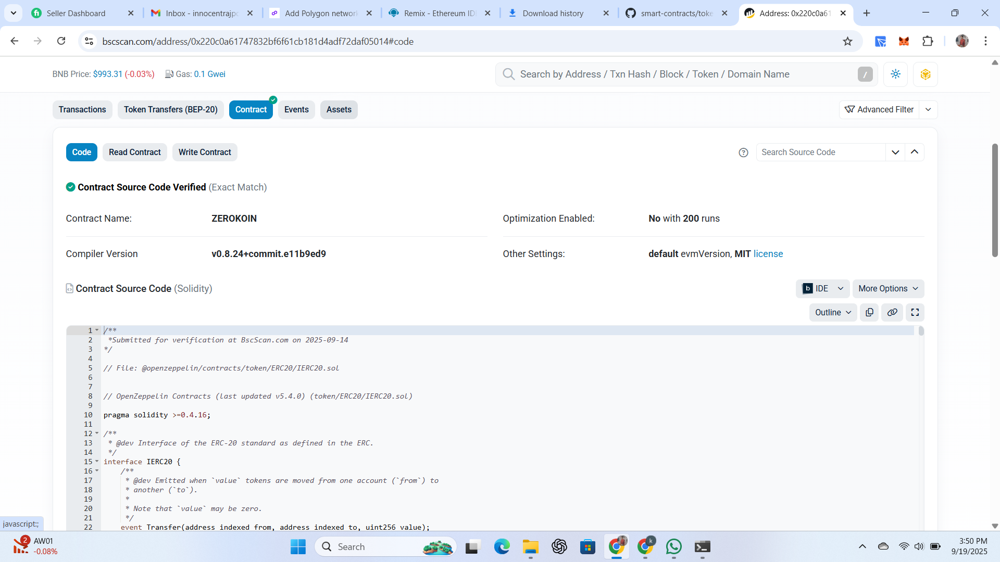
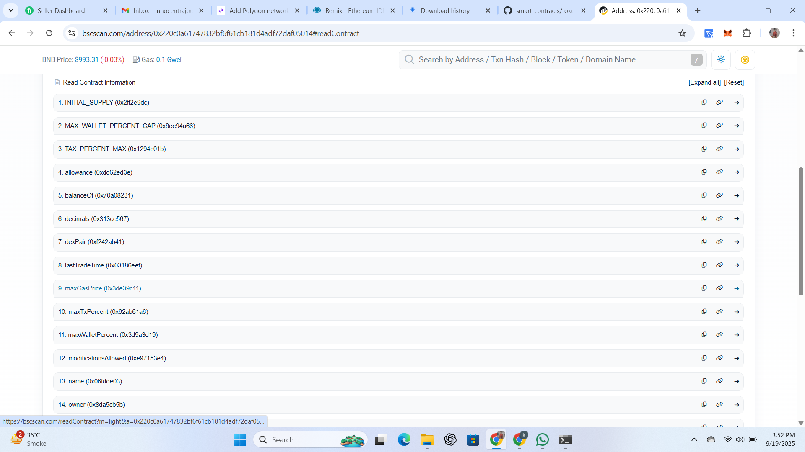
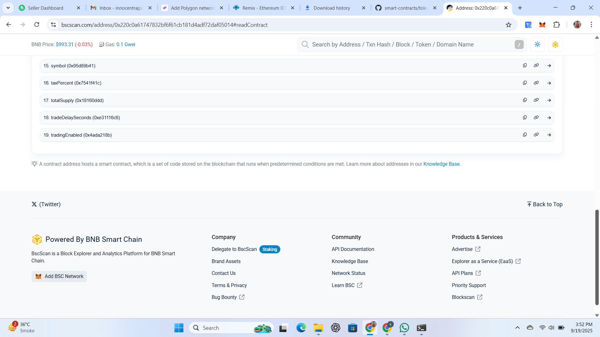
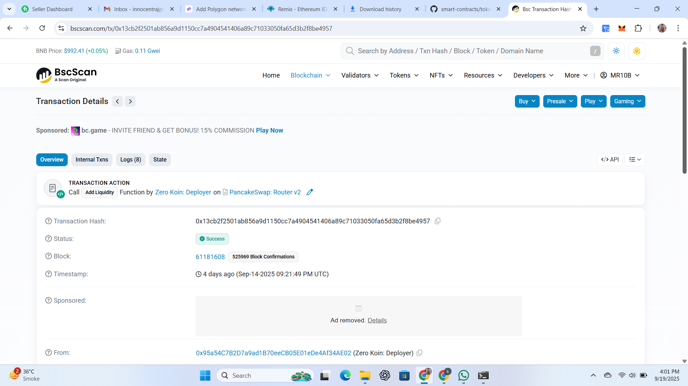

\# Zero Koin (ZRK)

\- **\*\*Token Name:\*\*** Zero Koin  

\- **\*\*Token Symbol:\*\*** ZRK

\- **\*\*Smart Contract Address (testnet):\*\*** 0x1C91975E11483F099B833EB3BfF6A677288d873B

\- **\*\*Smart Contract Address(mainnet):\*\*** 0x220c0a61747832bf6f61cb181d4adf72daf05014  

\- **\*\*Verification:\*\*** VERIFIED  

\- **\*\*Network:\*\*** BNB Smart Chain (BSC)  

\- **\*\*Live Link:\*\*** https://bscscan.com/token/0x220c0a61747832bf6f61cb181d4adf72daf05014

\- **\*\*Liquidity:\*\*** PancakeSwap

\- **\*\*Tool:\*\*** Remix IDE  

\- **\*\*Language:\*\*** Solidity  

&nbsp; 

&nbsp; 

&nbsp; 

&nbsp; 

&nbsp; 

&nbsp; 

&nbsp; 

&nbsp; 

&nbsp; 

